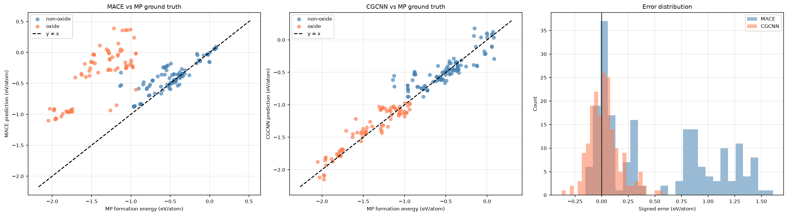

# Knowledge-Graph-Grounded, Cost-Aware Decision Agent for Materials Discovery

**catalyst-kg-agent** is a multi-agent system that helps a materials-discovery campaign choose the *cheapest sufficient* next action — a knowledge-graph lookup, a lower-fiedlity MLIP surrogate query, or an expensive higher-fidelity simulated experiment — the same decision real self-driving-lab (SDL) orchestration has to make under a budget.

**Status:** working demo. The knowledge graph builds, the agent loop runs end to end under a budget, and the surrogate evaluation has been run with results reported below. The "expensive experiment" step is simulated, not a real synthesis or DFT job — see [Limitations](#limitations).

---

## Table of Contents

- [Knowledge-Graph-Grounded, Cost-Aware Decision Agent for Materials Discovery](#knowledge-graph-grounded-cost-aware-decision-agent-for-materials-discovery)
  - [Table of Contents](#table-of-contents)
  - [The Problem](#the-problem)
  - [How It Works](#how-it-works)
  - [Results](#results)
    - [Knowledge graph](#knowledge-graph)
    - [MACE surrogate validation](#mace-surrogate-validation)
    - [Surrogate comparison — MACE vs CGCNN](#surrogate-comparison--mace-vs-cgcnn)
    - [Finding: MACE's error is concentrated in transition-metal oxides](#finding-maces-error-is-concentrated-in-transition-metal-oxides)
    - [CGCNN baseline: leakage-controlled cross-validation](#cgcnn-baseline-leakage-controlled-cross-validation)
    - [Worked example: three campaigns](#worked-example-three-campaigns)
    - [Escalation gate calibration](#escalation-gate-calibration)
    - [Inference cost](#inference-cost)
  - [Setup](#setup)
  - [Running It](#running-it)
    - [Campaign flags](#campaign-flags)
  - [Architecture](#architecture)
    - [Agent roles](#agent-roles)
    - [Cost model](#cost-model)
    - [Property tiers](#property-tiers)
  - [Repository Structure](#repository-structure)
  - [Data](#data)
  - [Limitations](#limitations)
  - [Design Decisions \& Alternatives Considered](#design-decisions--alternatives-considered)
  - [Stretch Goals](#stretch-goals)
  - [Citations \& Further Reading](#citations--further-reading)
  - [Acknowledgments](#acknowledgments)

---

## The Problem

Materials-discovery teams building self-driving labs face a recurring decision: given a target property and a limited budget, what should be tried next — a cheap database lookup, a fast ML surrogate estimate, or an expensive real (or simulated) experiment? Get this wrong and either the budget is wasted on redundant expensive steps, or an unreliable surrogate result gets trusted without a check.

This project builds a small, locally-runnable version of that decision system: a knowledge graph as the memory/grounding layer, an MLIP as the property surrogate, and a role-specialized multi-agent system that picks actions under an explicit cost budget — with a dedicated safety check before anything expensive is allowed to run.

---

## How It Works

```
Materials Project  →  kg/build_graph.py  →  NetworkX knowledge graph
                                                  │
                                                  ▼
                                    agent/campaign.py (owns budget)
                                                  │
                                   consults agent/planner.py for
                                   continue / escalate / stop
                                                  │
                       ┌──────────────┬───────────┼───────────┬──────────────┐
                       ▼              ▼           ▼           ▼              ▼
                  Retriever      Predictor     Critic       Scribe    (optional, final only)
                  [LLM]           (MACE)     (stability +   (writes    UMA relaxation check
                (KG lookup)                 residual-force   results
                                                gate)      back to KG)

   Planner [LLM] orders candidates; per candidate: predict -> validate -> escalate
```

At each step the campaign orchestrator retrieves candidates (cheap KG lookup), scores them with the MACE surrogate (moderate cost), and passes the results to the **Critic**, which must approve before any escalation. The Critic applies two independent checks:

1. **Stability** — `e_above_hull` below threshold, read from the KG's Materials-Project-derived value (not from the surrogate).
2. **Surrogate trustworthiness** — the maximum residual force MACE predicts on the structure. Every structure in the corpus is a DFT-relaxed MP geometry, so DFT's own forces on it are approximately zero by construction. A large MACE residual force means MACE and DFT disagree about where the atoms belong, i.e. the surrogate is outside the region where it can be trusted for this material. That is what warrants an expensive check.

The **Scribe** writes surrogate predictions back into the knowledge graph as new `PropertyNode`s tagged with their source, so later campaigns start from accumulated results rather than from scratch. Campaign-level bookkeeping (cost, escalations, outcome) lives in the JSON journal and MLflow, not in the KG — the graph holds materials and properties only.

All inter-agent messages use strict Pydantic schemas — agents chain by matching typed contracts, not free-form text.

This decomposition obeys the following concept: the Planner plays the Reasoning Core role, the knowledge graph is the Knowledge Substrate, the Critic is the Trust Layer, MACE/CGCNN are the Domain Foundation Model, and the optional UMA relaxation check stands in for a 1st-principles verification step.

**Scope relative to similar work:** [`AdsMind`](https://github.com/NagatoBigSeven/AdsMind) — a physics-grounded multi-agent system that self-corrects a *single* adsorption configuration using MLIP-relaxation feedback — solves an adjacent but distinct problem: per-candidate structural correction, rather than this project's focus on cross-candidate, budget-constrained decisions about which action to spend resources on next.

---

## Results

All numbers below were produced by the scripts in this repository against the 130-material corpus described in [Data](#data). Raw outputs are in `models/*.json` and `data/processed/force_distribution.json`.

### Knowledge graph

| | |
|---|---|
| Materials | 189 |
| Nodes / edges | 983 / 1343 |
| Node types | Material 189, Structure 189, Property 567, Chemsys 26, Element 12 |
| Properties | `energy_above_hull` ×189, `formation_energy_per_atom` ×189, `band_gap` ×189 |
| `e_above_hull` range | 0.0000 – 0.0985 eV/atom (median 0.0166) |
| Pass the 0.05 stability ceiling | 130 of 189 |
| Distinct compositions | 98 (69% of materials share a formula) |
| Oxides / non-oxides | 84 / 105 |
| CIF parse failures | 0 |

### MACE surrogate validation

Formation energies are computed as `E_material − Σ xᵢ·E_ref,ᵢ`, where the elemental references are evaluated with the **same** MACE checkpoint (`models/elemental_references.py`), so both terms sit on one energy scale.

Spot-check against Materials Project for Ni₁₂P₅ (mp-2790):

| | eV/atom |
|---|---|
| MP `formation_energy_per_atom` | −0.4714 |
| MACE-derived | −0.4837 |
| **Absolute error** | **0.0123** |

12 meV/atom agreement on a zero-shot foundation model evaluated on an unrelaxed MP geometry.

### Surrogate comparison — MACE vs CGCNN

Both models predict `formation_energy_per_atom` and are scored against the same MP target. MACE is zero-shot; CGCNN is trained on this corpus and evaluated **out-of-fold** (each material scored by the fold model that never saw it).

| Model | Subset | n | MAE | RMSE | R² |
|---|---|---|---|---|---|
| MACE (zero-shot) | overall | 189 | 0.530 | 0.735 | −0.72 |
| | non-oxides | 105 | **0.114** | 0.184 | 0.64 |
| | oxides | 84 | 1.049 | 1.083 | −9.46 |
| CGCNN (out-of-fold) | overall | 189 | 0.111 | 0.150 | 0.93 |
| | non-oxides | 105 | 0.120 | 0.169 | 0.69 |
| | oxides | 84 | 0.099 | 0.122 | 0.87 |



*Left:* MACE's oxides (orange) sit well above the y = x line while its
non-oxides (blue) straddle it — the discrepancy is a property of the chemistry,
not a uniform inaccuracy. *Centre:* CGCNN, trained on these targets, tracks
both classes. *Right:* the same thing as an error distribution — MACE is
bimodal, with a cluster near zero and a second around +1 eV/atom; CGCNN is
unimodal and centred. Generated by `models/surrogate_comparison.py`.

**Read this carefully.** CGCNN's apparent win is largely a property of the benchmark, not evidence that it models the physics better. CGCNN was trained on MP's target values and absorbed whatever correction scheme is in them; MACE never saw those targets. MACE's fair headline figure is the **non-oxide MAE of 0.114 eV/atom** — the overall figure is dominated by the artefact described next.

### Finding: MACE's error is concentrated in transition-metal oxides

MACE's error scales with **metal** content, not oxygen content. Mean MACE error per transition-metal atom:

| Subset | n | Mean signed error (eV/atom) |
|---|---|---|
| non-oxides | 105 | **+0.089** |
| oxides | 84 | **+1.049** |
| gap | | **+0.960** |

Measured per transition-metal atom on the earlier 130-material corpus, the
same split showed non-oxides at +0.03 to +0.46 eV per metal atom against
oxides at +1.16 to +3.19 — the same element (Co, Fe, Mn, Ni) shifting by
5–10× once oxygen is present. Widening the corpus to 189 materials (84
oxides) left the pattern intact.

The same element shows a 5–10× larger error once oxygen is present. This is consistent with Materials Project computing transition-metal oxides with **GGA+U** while computing elemental references and most non-oxides with plain GGA, then reconciling the two with a fitted correction scheme (Jain et al. 2011; Wang et al. 2021). MP formation energies for these systems are therefore not on a single level of theory, and a zero-shot MLIP has no way to reproduce the scheme.

Stated as a consistent explanation, not a proven mechanism: the error magnitudes are roughly half the corresponding Hubbard U values and the element ordering is not an exact match. Two earlier hypotheses — MP's oxygen anion correction, and a poor molecular-O₂ reference — were tested against the data and rejected, because both predict error scaling with oxygen fraction and the observed scaling is with metal fraction.

### CGCNN baseline: leakage-controlled cross-validation

The corpus contains 189 materials across only 98 distinct compositions (13 MnO₂ polymorphs, 10 CoO₂, 8 NiS₂, 7 MoS₂, 6 WS₂ …); 69% of materials share a formula with another entry. A random CV split lets polymorphs of one composition appear in both training and test folds, so the model can score well by learning composition → energy rather than any structure–property relationship.

Both splits, 5-fold:

| Split | MAE (eV/atom) | RMSE | R² |
|---|---|---|---|
| Random | 0.0863 ± 0.0086 | 0.130 ± 0.044 | 0.941 ± 0.037 |
| **Composition-disjoint** | **0.1110 ± 0.0198** | 0.146 ± 0.031 | 0.904 ± 0.065 |
| Mean-predictor baseline | 0.475 | — | — |

Folds are near-balanced (38/38/38/38/37) and each large polymorph family
lands in a different fold — MnO₂ (13) in fold 1, CoO₂ (10) in fold 2, NiS₂
(8) in fold 3, MoS₂ (7) in fold 4, WS₂ (6) in fold 5.

The composition-disjoint number is the generalisation estimate. Degradation is modest (~29% on MAE), which indicates the model learned genuine structure–property signal rather than composition lookup. Both are reported because the gap is itself the measurement.

Reproduce with `--group-by-composition` (see [Running It](#running-it)).

### Worked example: three campaigns

A real run, immediately after building the knowledge graph. Each campaign
starts with a 100-unit budget (`kg_lookup` 1.0, `surrogate_query` 5.0,
`experiment_escalation` 10.0, plus 0.5 fixed overhead).

| | demo-001 | demo-002 | demo-003 |
|---|---|---|---|
| Query | default (broad) | default (broad) | *"Find stable Ni-P HER catalysts"* |
| Already in KG, skipped | 0 | 19 | 36 |
| Materials evaluated | 19 | 17 | 4 |
| Escalations | 0 | **1** | 0 |
| Spent / remaining | 96.5 / 3.5 | 96.5 / 3.5 | 22.5 / **77.5** |
| Termination | `budget_exhausted` | `budget_exhausted` | `completed` |
| Best candidate | mp-1005 | mp-1274279 | **mp-21167 (Ni₂P)** |

Three things this shows.

**The knowledge graph accumulates.** demo-002 opened with *"19 materials
already predicted in earlier campaigns; skipping them"* and demo-003 with 36.
Across the three runs, 19 + 17 + 4 = 40 distinct materials carry a
`mace_energy_per_atom` property, with no material scored twice. Campaign *n*
starts from what campaigns *1…n−1* learned rather than from scratch.

**Escalation costs screening.** In demo-002 the Critic flagged mp-943 (Co₃S₄)
with a residual force of 0.795 eV/Å, above the 0.5 gate. The escalation was
afforded and charged: 10 units, which is exactly the two surrogate calls that
separate demo-002's 17 evaluations from demo-001's 19. That trade — spend
screening budget on verification when the surrogate cannot be trusted — is
what the cost model exists to express.

**A targeted query terminates differently.** demo-003's natural-language query
was parsed by the Retriever into `chemsys=[Ni-P] + stability ≤ 0.05`, resolving
to the 8 nickel phosphides that pass the stability ceiling. Four had already
been scored in demo-001, so it evaluated the remaining four and stopped with
77.5 units unspent, terminating `completed` (candidates exhausted) rather than
`budget_exhausted`. Its top pick was **Ni₂P (mp-21167)** — a high-efficiency, 
non-noble metal HER catalyst — which is a reasonable answer to the question asked.

**On reproducibility:** the Planner is an LLM, so candidate ordering varies
between runs, and which material gets escalated varies with it. This is *a*
run, not *the* run — the aggregate behaviour is stable, the specific escalation
is not.

### Escalation gate calibration

The Critic's `FORCE_GATE_EV_PER_ANG` was set from the measured distribution, not guessed. MACE residual forces across all 130 materials:

| Statistic | eV/Å |
|---|---|
| median | 0.212 |
| mean ± std | 0.253 ± 0.198 |
| 90th / 95th percentile | 0.527 / 0.653 |
| max | 0.985 |

| Gate | Materials escalated |
|---|---|
| 0.10 | 141 / 189 (74.6%) |
| 0.20 | 97 / 189 (51.3%) |
| **0.50** | **23 / 189 (12.2%)** |
| 1.00 | 0 / 189 (0%) |

**Gate set to 0.5 eV/Å.** The distribution is smooth with no natural boundary, so this is a judgement about escalation *rate*, not a threshold the data picked out. Lower gates escalate most of the corpus and destroy the cost-tiering the project is built around.

The escalated set is chemically coherent: CoO₂ (×2), Co₃S₄, MnO₂ (×4), IrO₃, MnP₂ — predominantly Mn/Co oxides, the same GGA+U systems flagged above by an independent measurement.

**The two Critic-relevant signals are orthogonal.** Residual force and
`e_above_hull` are uncorrelated across the corpus (Pearson r = **+0.011**,
n = 189); median force is 0.223 eV/Å for materials at or below the 0.05
stability ceiling and 0.189 above it. Relaxing the stability range from 0.05
to 0.1 barely moved the force distribution at all (median 0.223 → 0.212).

That is the justification for having both checks rather than one. Stability is
a property of the **material** — "is this worth pursuing?", known for free from
MP, enforced as a retrieval constraint. Residual force is a property of the
**model's competence on that material** — i.e., "can I trust the number my surrogate
just produced?", knowable only after MACE has run. A candidate can pass one and
fail the other: mp-644514 (MnO₂) is comfortably stable yet carries a residual
force of 0.767 eV/Å, so its cheap estimate warrants verification before being
believed. A stability filter alone would have waved it through with a bad
number attached.

### Inference cost

| Model | Mean s/material | Median |
|---|---|---|
| MACE (CPU) | 0.121 | 0.094 |

---

## Setup

Requires:
- Python 3.10+
- A Materials Project API key (the only external credential needed — no VASP/HPC scheduler credentials, since no remote DFT job submission is used)
- Ollama running locally with a small instruction-tuned model pulled, for the Retriever's optional natural-language query parsing
- Optional: a CUDA-capable GPU. Everything above was run on CPU.

```bash
git clone <this-repo>
cd catalyst-kg-agent
pip install -r requirements.txt
cp .env.example .env   # fill in MP_API_KEY
ollama pull gemma4:latest  # or your preferred model
```

`.env` keys:

```
MP_API_KEY=...
OLLAMA_BASE_URL=http://localhost:11434/v1
OLLAMA_MODEL=gemma4:latest
MLFLOW_TRACKING_URI=sqlite:///mlflow.db
INITIAL_BUDGET=100.0
MAX_EXPERIMENTS=10
STABILITY_THRESHOLD=0.1          # e_above_hull, eV/atom
FORCE_GATE_EV_PER_ANG=0.5        # Critic escalation gate
MACE_CHECKPOINT=mace-mpa-0-medium
```

The MACE checkpoint (`models/mace-mpa-0-medium.model`) is committed but you can also download it from the [MACE releases](https://github.com/ACEsuit/mace).
The MACE checkpoint (`models/mace-omat-0-medium.model`) is also provided for testing purposes, but was not used in this project.

---

## Running It

Order matters — each step consumes the previous step's output.

```bash
# 1. Pull Materials Project metadata + structures
python data/download.py

# 2. Build the knowledge graph
python kg/build_graph.py --clear-cache

# 3. Compute MACE elemental reference energies (needed for formation energies)
python models/elemental_references.py

# 4. Calibrate the Critic's escalation gate against the corpus
python scripts/calibrate_force_gate.py

# 5. Train the CGCNN baseline (composition-disjoint CV; writes out-of-fold predictions)
python models/baseline_cgcnn.py --train --k-folds 5 --group-by-composition

# 6. Compare the two surrogates
python models/surrogate_comparison.py

# 7. Run a budget-bounded campaign
python scripts/run_campaign.py --campaign-id demo-001
```

### Campaign flags

```
python scripts/run_campaign.py [--campaign-id ID] [--query "..."] [--budget N]
                               [--mode batch|sequential]
                               [--ollama-model NAME] [--mace-checkpoint NAME]
```

| Flag | Default | What it does |
|---|---|---|
| `--campaign-id` | random 8-char id | Names the run. Becomes the journal filename `agent/journal/<id>.json` and the MLflow experiment name. Reuse of an id overwrites that journal. |
| `--query` | *"find all stable materials"* | Natural-language query for the Retriever. Parsed by the LLM into element / chemsys / stability constraints, applied as a conjunction. A narrow query means fewer candidates and an earlier `completed` termination. |
| `--budget` | `INITIAL_BUDGET` (100.0) | Starting budget. At the default action costs this funds roughly 19 surrogate calls, or fewer if escalations fire. |
| `--mode` | `batch` | `batch` writes surrogate predictions to the KG once at the end; `sequential` writes after each loop iteration. Results are identical — `sequential` just makes partial progress durable if a run is interrupted. |
| `--ollama-model` | `OLLAMA_MODEL` from `.env` | Overrides the model used by the Retriever and Planner. |
| `--mace-checkpoint` | `MACE_CHECKPOINT` from `.env` | Overrides the surrogate checkpoint. Note the elemental references in `data/processed/mace_elemental_refs.json` are tied to a specific checkpoint — changing this without regenerating them makes formation energies inconsistent. |

Useful things to know:

- **Campaigns resume.** Materials already carrying a `mace_energy_per_atom`
  property are skipped, so successive runs advance through the corpus instead
  of re-deriving earlier results. Run three campaigns and you cover roughly 60
  materials, not the same 19 three times.
- **Termination status is meaningful.** `budget_exhausted` means the budget ran
  out — the expected end of a broad sweep. `completed` means the candidate pool
  was exhausted first, which is what a narrow query usually produces.
  `failed` is reserved for genuine errors.
- **Results are not bit-reproducible.** The Planner is an LLM, so candidate
  ordering — and therefore which materials get evaluated and which escalations
  fire — varies between runs on the same corpus.

To start over from a clean graph:

```bash
python kg/reset.py --clear-cache
python kg/build_graph.py --clear-cache
```

Tests:

```bash
python tests/test_queries.py
python tests/test_predictor.py
python tests/test_critic.py
python tests/test_critic_escalation.py
python tests/test_planner.py
python tests/test_retriever.py
```

These are standalone scripts with `[PASS]`/`[FAIL]` output and nonzero exit codes on failure, not pytest modules.

---

## Architecture

### Agent roles

Two of the five roles use an LLM; three are deterministic. Which is which is a
deliberate choice, not an accident of implementation.

- **Retriever** *(LLM)* — parses a natural-language query into a structured
  intent (`elements`, `chemsys`, `threshold`) and executes it as a
  conjunction of constraints over the graph. Query formulation against a
  large graph involves real ambiguity, which is where a language model earns
  its cost.
- **Predictor** — owns MACE surrogate calls. Returns raw energy per atom,
  formation energy per atom (via cached elemental references), and the max
  residual force used as the trust signal.
- **Critic** — validates each candidate as it is scored. Checks
  `e_above_hull` stability against the KG's MP-derived value, and escalates
  when the surrogate's residual force exceeds the gate. Deliberately
  deterministic: this is the safety property, and a threshold check is not
  something a language model does better.
- **Planner** *(LLM, for prioritisation only)* — decides the **order** in
  which remaining candidates are evaluated, given what the campaign has
  learned so far. With budget for roughly 19 of 130 candidates, which 19 is
  the substantive decision, and this is the acquisition-function role in an
  active-learning loop. Its continue/escalate/stop logic is separate and
  fully deterministic — budget arithmetic and termination guarantees are not
  delegated to a model.
- **Scribe** — writes surrogate predictions back into the KG as
  source-tagged `PropertyNode`s.

**Constraining the LLM's influence.** The Planner returns identifiers and a
sentence, never structured material data. Every returned mpid is validated
against the candidate list: unknown ids are dropped, duplicates ignored, and
omitted candidates appended in their original order, so the output is always
a permutation of the input. The worst a malformed or adversarial response can
do is produce a poor ordering — it cannot lose a candidate, invent one, or
authorise spending. If Ollama is unreachable the Planner falls back to the
corpus order and the campaign proceeds; the `provenance` field on each
prioritisation records which path was taken.

**Screening is incremental.** Each candidate is predicted, validated, and
escalated (if warranted) before the next one is scored — not predicted in a
batch and judged afterwards. This matters for more than tidiness: with
batch-then-judge, a campaign spent 95 of its 99.5 units on predictions before
the Critic ever saw them, so a flagged escalation could no longer be
afforded. Screening one at a time lets verification compete with screening
for the same budget, which is how a real screening loop behaves.

The campaign orchestrator (`agent/campaign.py`) owns the `BudgetTracker` and
performs all cost deduction; the Planner informs decisions but never deducts.
Its internal `PlannerState.remaining_budget` exists for standalone use and is
not authoritative during a campaign.

### Cost model

Each action type has an explicit cost unit in `agent/cost_model.py`:

| Action | Cost |
|---|---|
| `kg_lookup` | 1.0 |
| `surrogate_query` | 5.0 |
| `experiment_escalation` | 10.0 |
| campaign overhead (fixed) | 0.5 |

Default budget 100.0, max 50 actions, max 10 escalations. Costs and outcomes are logged per campaign to `agent/journal/<campaign_id>.json` and MLflow.

### Property tiers

Three energy scales appear in this project and are never mixed numerically:

| Tier | Source | Used for |
|---|---|---|
| **MP** | Materials Project DFT | `e_above_hull` stability gate, CGCNN training target, comparison ground truth |
| **MACE** | `mace-mpa-0-medium` | surrogate ranking, formation energies (with MACE's own elemental references), residual-force trust signal |
| **UMA** | FAIRChem OMat24 | optional final relaxation showcase only |

`PropertyNode.source` records which tier a stored value came from. MACE predictions are written under `mace_energy_per_atom`, never merged into MP's `energy_above_hull`.

---

## Repository Structure

```
catalyst-kg-agent/
├── README.md
├── requirements.txt
├── .env
├── mlflow.db                       # MLflow tracking store (sqlite)
│
├── docs/
│   └── PROJECT_STATE.md            # development log
│
├── data/
│   ├── download.py                 # Materials Project API pull
│   ├── raw/
│   │   ├── metadata.json
│   │   └── structures/             # 130 CIFs
│   └── processed/
│       ├── kg.json                 # canonical graph store
│       ├── kg.graphml              # best-effort interop export
│       ├── kg_build_report.json
│       ├── cif_cache.pkl
│       ├── cif_cache_meta.json
│       ├── mace_elemental_refs.json
│       └── force_distribution.json   # written by scripts/calibrate_force_gate.py
│
├── kg/
│   ├── schema.py                   # pydantic node/edge models, enums, ID helpers
│   ├── build_graph.py
│   ├── graph_store.py
│   ├── queries.py
│   └── reset.py
│
├── models/
│   ├── mace-mpa-0-medium.model    
│   ├── mace-omat-0-medium.model   
│   ├── elemental_references.py     # MACE reference energies for formation energy
│   ├── baseline_cgcnn.py           # from-scratch CGCNN baseline
│   ├── surrogate_comparison.py     # MACE vs CGCNN
│   ├── cgcnn_catalyst.pt
│   ├── cgcnn_training_metrics.json
│   ├── cgcnn_oof_predictions.json
│   └── mace_vs_cgcnn_comparison.json
│
├── agent/
│   ├── journal/                    # per-campaign JSON logs (demo-001.json, ...)
│   ├── retriever.py
│   ├── predictor.py
│   ├── critic.py
│   ├── planner.py
│   ├── scribe.py
│   ├── campaign.py
│   ├── cost_model.py
│   └── logging.py
│
├── tracking/
│   ├── mlflow_setup.py
│   ├── mlflow_verify.py
│   └── query_ml_flow_best_candidate.py
│
├── scripts/
│   ├── run_campaign.py             # CLI entry point for a campaign
│   ├── calibrate_force_gate.py     # measures the force distribution
│   ├── check_llm_agents.py         # verifies Ollama reaches both LLM agents
│   ├── check_retriever.py          # smoke-test for query -> intent -> results
│   ├── corpus_check.py             # KG composition / stability summary
│   ├── kg_check.py                 # counts MACE properties written back
│   └── summarize_campaigns.py      # reads agent/journal/*.json
│
├── notebooks/
│   ├── UMA_relaxation_showcase.ipynb
│   └── plots/
│       └── mace_vs_cgcnn_comparison.png
│
└── tests/
    ├── test_queries.py
    ├── test_retriever.py
    ├── test_predictor.py
    ├── test_critic.py
    ├── test_critic_escalation.py
    └── test_planner.py
```

---

## Data

**Source:** Materials Project, via the `mp-api` client.

**Filter** (exact criteria, in `data/download.py`):

- **Chemical systems (27):** HER-relevant transition-metal phosphides, sulfides and carbides (Ni/Co/Fe/Mo/W/Mn × P/S/C); OER-relevant oxides (Ni-O, Co-O, Fe-O, Mn-O, Ni-Fe-O, Co-Fe-O, Ni-Co-O); precious-metal benchmarks (Pt, Ir-O).
- **Stability:** `energy_above_hull` ∈ [0, 0.1] eV/atom. 0.05 is the conventional "metastable but synthesizable" cutoff; the pull goes to 0.1 so that `STABILITY_THRESHOLD` (0.05) has a band to actually exclude — with the pull and the threshold at the same value, nothing in the corpus could ever fail the stability constraint. See Sun et al., *Sci. Adv.* 2 (2016) e1600225 on the thermodynamic scale of metastability.
- **Size:** `num_sites` ≤ 20.
- **Cap:** top 500 by stability (not reached; 189 unique materials returned).

**Chemsys coverage:** 26 of the 27 requested systems are populated. **Co-C**
has no qualifying entries: Materials Project holds only two cobalt carbides,
Co₂C (0.109 eV/atom) and Co₃C (0.131 eV/atom), both just above the 0.1 ceiling.
Cobalt does not form a thermodynamically stable binary carbide, unlike Fe, Mn,
Mo, W and Ni.

**Stability is enforced at retrieval, not after the fact.** `e_above_hull` is
MP-derived and already in the graph, so filtering on it costs nothing and keeps
unsuitable candidates out of the pool before any budget is spent. Of the 189
materials in the KG, 130 pass the 0.05 ceiling and are eligible for campaigns;
the remaining 59 still serve the surrogate benchmark, which uses the whole
corpus. A query may ask for something stricter than the ceiling, never looser.

**Properties ingested:** `energy_above_hull` (drives the Critic's stability gate and campaign ranking), `formation_energy_per_atom` (CGCNN training target and surrogate-comparison target), `band_gap` (ingested to exercise the multi-property schema; **not read by the agent loop today**).

**Why not adsorption-energy datasets (OC20/OC25/AQCat25):** more directly relevant to catalytic activity, but a different scale and physics (millions of DFT calculations of slab + adsorbate + solvent systems, vs. Materials Project's bulk-only structures). Noted as a natural extension for a version of this project targeting adsorption energy directly.

---

## Limitations

**Scope**

- This pipeline selects for **bulk thermodynamic stability and surrogate confidence, not catalytic activity**. Nothing here predicts HER/OER performance — no adsorption energies, no overpotentials. Target-property modelling is out of scope and noted as a natural extension.
- Toy-scale demonstration, not a production SDL controller. The "expensive experiment" step deducts cost and logs an escalation; no synthesis, characterisation, or DFT job is actually run. The escalation *criterion* reflects real practice; the escalation *itself* is simulated.
- The knowledge graph is built from a single structured database rather than a federated, multi-source graph — a meaningfully harder problem real infrastructure (e.g. MaterialsCommons) is built to solve.

**Measurement**

- MACE formation energies disagree strongly with MP values for transition-metal oxides (~2.4–3.2 eV per metal atom, vs ~0.0–0.5 for the same metals in non-oxides), consistent with MP's GGA+U treatment of those systems. Comparisons are reported split oxide/non-oxide for this reason.
- Residual forces on the corpus have a median of 0.223 eV/Å, higher than would be expected for exactly-reproduced DFT-relaxed geometries. Two likely contributors: the CIF round-trip idealises fractional coordinates (pymatgen emits rounding warnings on ~9 structures), and MP's GGA+U systems are not reproducible by the surrogate. The gate therefore separates *relative* disagreement across the corpus, not absolute trustworthiness.
- The CGCNN baseline is trained on a few hundred materials — very small for a GNN trained from scratch. The published CGCNN used 10⁴–10⁵ structures. Reported metrics come with fold-to-fold spread for this reason.
- Every structure is an MP-relaxed geometry evaluated as-is. No relaxation is performed by the surrogate, so these are single-point energies at DFT-optimal geometries, not MACE-optimal ones.

**Implementation**

- UMA/OMat24-derived energies are not numerically compatible with MP-derived energies; they are kept in a strictly separate, labelled tier and used only in the optional showcase notebook. The UMA notebook requires FAIRChem, which is not a listed dependency; without it the notebook runs and reports the relaxation section as skipped rather than producing a result.
- Multi-agent design adds real coordination overhead and additional failure surface versus a single-agent pipeline. Chosen because independent role separation — particularly the Critic's gate before escalation — mattered more than raw simplicity for this problem, not because more agents are inherently better.
- `requirements.txt` was generated on Windows and pins Windows-only packages (`pywin32`, `triton-windows`); it needs regenerating for cross-platform installation.

---

## Design Decisions & Alternatives Considered

*This section is for readers who want the full rationale behind each choice.*

| Decision | Chosen | Alternatives considered | Why chosen |
|---|---|---|---|
| **Dataset source** | Materials Project (bulk properties) | OQMD (weaker natural graph structure); literature-mined synthesis data via `lematerial-llm-synthesis` (extraction-accuracy risk, frontier-API dependency); OC20/OC25/AQCat25 (adsorption-energy datasets, millions of DFT calculations, slab/solvent complexity) | MP gives structured, versioned, citable provenance out of the box, a natural node/edge shape for the KG, and direct compatibility with MACE's own MP-trained foundation checkpoint. |
| **Surrogate / MLIP** | MACE (`mace-mpa-0-medium`), zero-shot | CHGNet (better fit if dataset skewed ionic/oxide-heavy); GNN-from-scratch as sole surrogate | More mature tooling; more commonly cited across current MLIP literature and industry tooling. Used zero-shot rather than fine-tuned to keep the comparison against the trained CGCNN interpretable. |
| **GNN baseline** | Custom CGCNN-style GNN (PyTorch Geometric), used as an ablation against MACE | Pretrained MLIP only; from-scratch GNN as sole surrogate | Produces an actual accuracy/cost comparison rather than just "a model was used." |
| **Surrogate trust signal** | Max residual force on the DFT-relaxed geometry (eV/Å) | MC-Dropout uncertainty; multi-checkpoint ensemble spread; positional-perturbation sensitivity | MACE inference is deterministic and has no active dropout, so a "MC-Dropout" spread was identically zero for every material and could never fire the gate. Residual force is a standard practitioner check, varies meaningfully across materials, and costs no extra inference. An ensemble across `mace-mpa-0` and `mace-omat-0` was considered but rejected: the checkpoints have different energy references, so their spread would be dominated by a constant offset. |
| **Formation-energy references** | MACE-evaluated elemental ground states, cached | MP's DFT elemental energies; MACE's internal isolated-atom `E0`s | Keeps both terms of `E_f = E − Σx·E_ref` on the same energy scale. Using MP's DFT references would mix levels of theory; isolated-atom references give cohesive energy, a different quantity. |
| **Oxygen reference** | Molecular O₂ in a 15 Å vacuum box | Lowest-hull elemental oxygen crystal; excluding oxides entirely | O₂ is the standard reference state for oxygen. Excluding oxides would have removed 49/130 materials and the entire OER half of the corpus. |
| **CV split for the baseline** | Composition-disjoint (reported alongside random) | Random split only | 62% of the corpus shares a composition with another entry, so a random split leaks polymorphs between folds and inflates the score. Both are reported; the gap is the measurement. |
| **Final-fidelity check** | Optional single-shot ASE relaxation via FAIRChem's UMA, run only on the top candidate | Treating surrogate output as final; UMA as a third competing surrogate | One heavier-fidelity sanity check on the winning candidate without complicating the core cost loop; kept in a separate, non-comparable tier due to DFT-setting incompatibility with MP. |
| **KG storage** | NetworkX | Neo4j Community + Cypher; RDF/OWL via `rdflib` | Zero infrastructure, fastest to iterate on schema while it's still evolving. Neo4j/RDF kept as stretch goals. |
| **Agent framework** | pydantic-ai | atomic-agents (Instructor-based) | Reuses an existing personal toolchain; borrowed atomic-agents' strict I/O schema discipline as a pattern, not a framework switch. |
| **Multi-agent architecture** | Role-specialized agents with a hard budget and a Critic gate before escalation | Single monolithic agent; open-ended exploration loop (`ai-mandel`-style) | A real SDL mistake costs materials and time, not tokens — auditable, budget-constrained decisions prioritized over open-ended novelty-seeking. |
| **Budget ownership** | Campaign orchestrator owns the `BudgetTracker`; Planner advises | Planner owns the budget | Keeps a single source of truth for cost accounting. The Planner's own budget state is retained for standalone testing only. |
| **Orchestration granularity** | Single `campaign.py` runner with separated internal stages | Fully independent scripts per stage (`ai-mandel`-style) | Loop is tighter and budget-bounded rather than open-ended — a deliberate simplification given narrower scope. |
| **MD/batching infrastructure** | Not used | NVIDIA ALCHEMI Toolkit (`nvalchemi`) | Solves large-scale MD-throughput efficiency; this project does single-point inference, not large-scale MD sampling. |
| **Stability screening rule** | `e_above_hull` threshold as the Critic's first concrete gate | Vague, unspecified "plausibility check" | Mirrors the stability-screening step used in production materials-discovery agent workflows; a well-defined, MP-derivable threshold. |
| **Distributed/federated agent execution** | Not used — all agents run locally, in-process | Academy (Globus Compute + Parsl agentic middleware for federated, actor-model agent deployment across HPC/experimental facilities) | This project targets single-machine, local execution; Academy-style federated middleware is the natural path if the same agent roles were later deployed across real HPC and instrument resources rather than simulated ones. |

---

## Stretch Goals

- Add a target-property model (adsorption energy / overpotential proxy) so the pipeline selects for catalytic activity rather than stability alone.
- Fit elemental reference energies by least squares against training-fold targets. This would shrink the oxide error and make the comparison look tidier — but it would absorb the GGA+U discrepancy into fitted constants and hide the most interesting finding here, as well as breaking the clean "zero-shot vs corpus-trained" contrast. Recorded as a deliberate non-goal for now.
- Replace NetworkX with Neo4j Community + Cypher once the KG schema stabilizes.
- Add an `rdflib`-based RDF/OWL layer aligned with the CMSO/ASMO ontologies, following the ontology-mapping skill from [`materials-simulation-skills`](https://github.com/HeshamFS/materials-simulation-skills).
- Extend the Scribe agent's novelty-checking logic against known structures before treating candidates as new discoveries, following the [AtomisticSkills materials-discovery workflow](https://github.com/learningmatter-mit/AtomisticSkills/blob/main/.agents/workflows/materials-discovery.md).
- Enrich KG synthesis-route edges with literature-mined synthesis parameters, following [`lematerial-llm-synthesis`](https://github.com/LeMaterial/lematerial-llm-synthesis), adapted to local inference.
- Weight the Scribe's averaging of repeated predictions by the residual-force signal rather than taking a simple mean.
- Persist per-campaign candidate ordering so a campaign trace can be replayed deterministically despite the LLM Planner.

---

## Citations & Further Reading

- Bai, J. et al. *A dynamic knowledge graph approach to distributed self-driving laboratories.* Nature Communications (2024).
- Bai, J. et al. *From Platform to Knowledge Graph: Evolution of Laboratory Automation.* JACS Au (2022).
- Jain, A. et al. *Formation enthalpies by mixing GGA and GGA+U calculations.* Phys. Rev. B 84, 045115 (2011) — the MP correction scheme behind the transition-metal-oxide discrepancy reported above.
- Wang, A. et al. *A framework for quantifying uncertainty in DFT energy corrections.* Sci Rep 11, 15496 (2021).
- Xie, T. & Grossman, J. C. *Crystal Graph Convolutional Neural Networks for an Accurate and Interpretable Prediction of Material Properties.* Phys. Rev. Lett. 120, 145301 (2018) — the CGCNN architecture reimplemented here.
- [Acceleration Consortium — Awesome Self-Driving Labs](https://github.com/AccelerationConsortium/awesome-self-driving-labs)
- [`ai-mandel`](https://github.com/artificial-scientist-lab/ai-mandel) — iterative Researcher/Novelty-Supervisor/Judge agent loop pattern.
- [`atomic-agents`](https://github.com/Eigenwise/atomic-agents) — strict input/output schema chaining discipline for agents.
- [`GNN-materials`](https://github.com/polbeni/GNN-materials) — CGCNN-style GNN implementation reference.
- [`AtomisticSkills`](https://github.com/learningmatter-mit/AtomisticSkills) — materials-discovery agent workflow, including the stability-screening pattern adopted for the Critic agent.
- [`materials-simulation-skills`](https://github.com/HeshamFS/materials-simulation-skills) — CMSO/ASMO ontology skill referenced for the RDF stretch goal.
- [`lematerial-llm-synthesis`](https://github.com/LeMaterial/lematerial-llm-synthesis) — literature-mined synthesis-parameter extraction, noted as future work.
- [FAIRChem / UMA](https://github.com/facebookresearch/fairchem) — used for the optional final-fidelity relaxation check.
- Zhang, Z. et al. *AdsMind: A Physics-Grounded Multi-Agent System for Self-Correcting Discovery of Adsorption Configurations on Heterogeneous Catalyst Surfaces.* arXiv:2606.19152 (2026) — closely related architecture (LLM planner + MACE-MP relaxation feedback, multi-backend LLM including Ollama); see the Scope note above for how this project differs.
- Prince, C. et al. *Opportunities for retrieval and tool augmented large language models in scientific facilities.* npj Computational Materials (2024) — the CALMS retrieve-then-escalate-if-uncertain pattern this project's Retriever/Predictor/Critic loop follows.
- Foster, I. & Kamatar, A. *AI Agents for Science*, Lecture 6: HPC Systems and Self-Driving Labs. CMSC 35370, University of Chicago (2026). [agents4science.github.io](https://agents4science.github.io) — source of the AI-native Scientific Discovery Platform reference architecture cited above, and of the Academy federated-agent middleware noted in Design Decisions.

---

## Acknowledgments

Parts of this codebase were developed with assistance from Qwen 3.5 9B running locally for the project layout and scaffolding, and Claude Opus 5 for extensive coding secions and intense debugging.